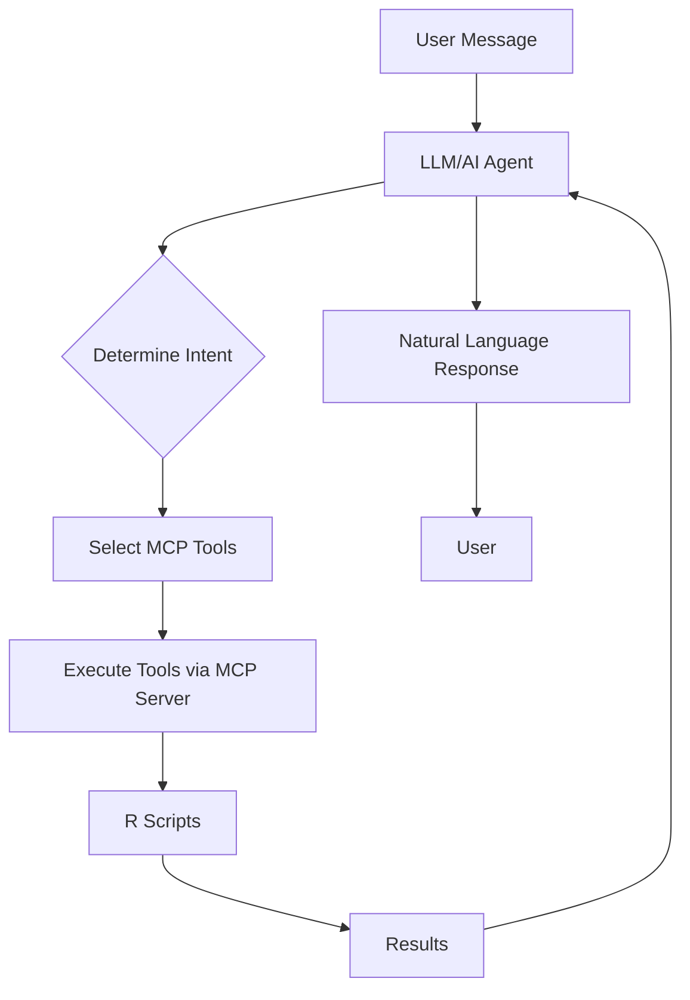

# 🤖 Meta-Analysis AI Chatbot

A true conversational AI assistant for conducting meta-analyses, powered by LLMs (GPT-4/Claude) with automatic tool orchestration.

## 🌟 Features

- **Natural Language Interface**: Chat with the AI to conduct your meta-analysis
- **Automatic Tool Orchestration**: The AI decides which tools to use based on your request
- **Multi-LLM Support**: Works with OpenAI GPT-4 or Anthropic Claude
- **Conversation Memory**: Maintains context across the entire analysis session
- **Educational Explanations**: Get explanations of statistical concepts as you work
- **Smart Workflow Guidance**: The AI guides you through the proper analysis steps

## 🚀 Quick Start

### Local Development

1. **Install dependencies**:
```bash
pip install -r poc/gradio-mcp/requirements-chatbot.txt
```

2. **Set API keys**:
```bash
export OPENAI_API_KEY="your-openai-key"
# OR
export ANTHROPIC_API_KEY="your-anthropic-key"
```

3. **Run the chatbot**:
```bash
# Basic version
python poc/gradio-mcp/chatbot_app.py

# LangChain-enhanced version (recommended)
python poc/gradio-mcp/chatbot_langchain.py
```

4. **Open browser**: Navigate to http://localhost:7860

### Docker Deployment

1. **Build the image**:
```bash
docker build -f poc/gradio-mcp/Dockerfile.chatbot -t meta-analysis-chatbot .
```

2. **Run with API keys**:
```bash
docker run -p 7860:7860 \
  -e OPENAI_API_KEY="your-key" \
  -v $(pwd)/sessions:/app/sessions \
  meta-analysis-chatbot
```

## 💬 Example Conversations

### Starting an Analysis
```
You: "I need to conduct a meta-analysis of clinical trials comparing two treatments"
AI: "I'll help you set up a meta-analysis for clinical trials. Let me initialize a session for you..."
[AI automatically calls initialize_meta_analysis tool]
```

### Uploading Data
```
You: "Here's my CSV data with study results:
study_id,effect_size,se
Study1,0.5,0.1
Study2,0.3,0.12
..."
AI: "I'll upload and validate your data now..."
[AI automatically encodes and uploads the data]
```

### Running Analysis
```
You: "Run the analysis and check for publication bias"
AI: "I'll perform a comprehensive meta-analysis with heterogeneity testing and publication bias assessment..."
[AI runs multiple tools in sequence]
```

### Getting Explanations
```
You: "What does the I² value of 75% mean?"
AI: "An I² value of 75% indicates substantial heterogeneity in your meta-analysis. This means that 75% of the variability in effect estimates is due to heterogeneity between studies rather than sampling error..."
```

## 🛠️ Architecture

### Components

1. **chatbot_app.py**: Basic implementation with direct LLM integration
2. **chatbot_langchain.py**: Advanced version using LangChain for better tool orchestration
3. **server.py**: MCP server that bridges to R scripts
4. **R Scripts**: Statistical analysis backend (same as TypeScript version)

### How It Works



## 🎯 Use Cases

### Research Workflow
1. Initialize project with study parameters
2. Upload and validate data
3. Run statistical analysis
4. Generate visualizations
5. Assess bias and heterogeneity
6. Create publication-ready reports

### Educational Mode
- Ask about statistical concepts
- Get interpretations of results
- Understand appropriate methods
- Learn best practices

### Automated Analysis
- Paste data and let AI handle everything
- Get comprehensive analysis with one request
- Receive interpreted results, not just numbers

## 🔧 Configuration

### Environment Variables
```bash
OPENAI_API_KEY        # OpenAI API key
ANTHROPIC_API_KEY     # Anthropic API key (alternative)
SESSIONS_DIR          # Directory for session storage
GRADIO_SERVER_NAME    # Server binding (default: 0.0.0.0)
GRADIO_SERVER_PORT    # Port (default: 7860)
```

### LLM Selection
The system automatically selects available LLMs in this order:
1. OpenAI GPT-4 (if OPENAI_API_KEY is set)
2. Anthropic Claude (if ANTHROPIC_API_KEY is set)

## 🚢 Deployment to Hugging Face Spaces

1. **Create a new Space** on Hugging Face
2. **Add secrets** for API keys:
   - OPENAI_API_KEY or ANTHROPIC_API_KEY
3. **Upload files**:
   - chatbot_langchain.py (rename to app.py)
   - server.py
   - requirements-chatbot.txt (rename to requirements.txt)
   - scripts/ directory
4. **Set Space SDK** to Gradio
5. **Deploy** and share!

## 📊 Comparison with Form-Based UI

| Feature | Form-Based UI | AI Chatbot |
|---------|--------------|------------|
| User Experience | Manual tool selection | Natural conversation |
| Learning Curve | High - need to know tools | Low - just describe needs |
| Workflow | Rigid, step-by-step | Flexible, adaptive |
| Error Handling | Shows raw errors | Explains and suggests fixes |
| Educational Value | Limited | High - explains concepts |
| Automation | None | Full workflow automation |

## 🐛 Troubleshooting

### "No API key found"
- Ensure OPENAI_API_KEY or ANTHROPIC_API_KEY is set
- Check the key is valid and has credits

### "Tool not found"
- Ensure MCP server is running
- Check R scripts are in the correct location
- Verify R packages are installed

### "Session not found"
- The AI should maintain session automatically
- If lost, start a new analysis

## 📚 Advanced Features

### Custom Prompts
Modify the SYSTEM_PROMPT in the code to customize AI behavior for your specific needs.

### Tool Extensions
Add new tools by:
1. Creating R script in scripts/tools/
2. Adding tool description in TOOL_DESCRIPTIONS
3. Creating Pydantic model for parameters
4. Adding to LangChain tools list

### Memory Management
The LangChain version uses ConversationBufferMemory for full conversation history. Can be switched to ConversationSummaryMemory for longer sessions.

## 🎉 Why This Implementation?

This is the **true chatbot implementation** that was originally envisioned:
- ✅ Natural language interface
- ✅ LLM-powered intelligence
- ✅ Automatic tool orchestration
- ✅ Educational and helpful
- ✅ Ready for Hugging Face Spaces
- ✅ Production-ready with proper error handling

Perfect for researchers who want to focus on their analysis, not on learning tool syntax!